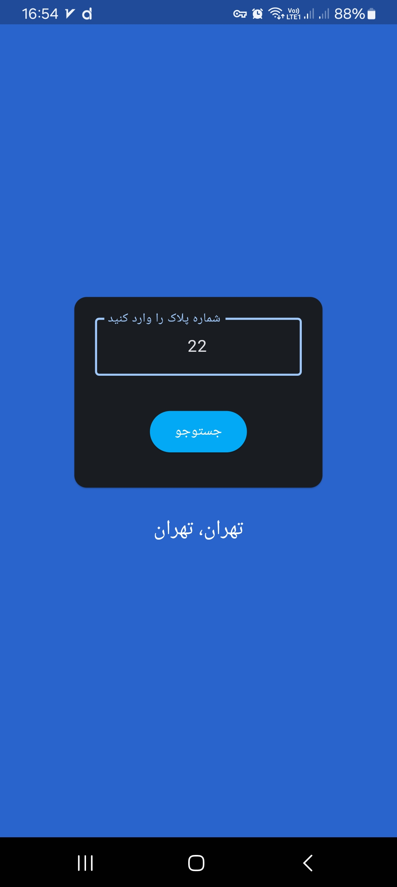

# PlateYab

**PlateYab** is a simple app built with [Flet](https://flet.dev/) that helps users identify the region of Iranian license plates based on the two-digit number. The app features a splash screen, a user-friendly interface, and supports Persian (Farsi) text.

## Features

- Splash screen with fade-in and fade-out effects.
- Persian (Farsi) support.
- Input validation for two-digit plate numbers.
- Provides city and province information based on the entered plate number.
- Simple and clean user interface.

## Screenshots



## Installation

To run **PlateYab** locally, you need to have Python installed. Follow these steps:

1. Clone the repository:

2. Create a virtual environment:
    ```bash
    python -m venv venv
    ```

3. Activate the virtual environment:

   - On Windows:
     ```bash
     venv\Scripts\activate
     ```

   - On macOS/Linux:
     ```bash
     source venv/bin/activate
     ```

4. Install the required dependencies:
    ```bash
    pip install -r requirements.txt
    ```

5. Run the app:
    ```bash
    flet run main.py
    ```

## Build

To build the app as a standalone executable (for Windows, macOS, or Linux), follow these steps:

 Just use flet build command:
```
flet build apk
```

## Folder Structure

```
PlateYab/
│
├── fonts/                 # Folder containing custom fonts (IRAN_Rounded.ttf)
│
├── data.py                # Contains the JSON data for mapping plate numbers to cities
│
├── main.py                # The main entry point of the app
│
├── requirements.txt       # Contains the list of Python dependencies
│
└── README.md              # This file
```

## Usage

1. Open the app.
2. Enter a two-digit Iranian plate number in the input field.
3. Click the **"جستوجو"** button to search for the corresponding city and province.
4. The result will be displayed on the screen.